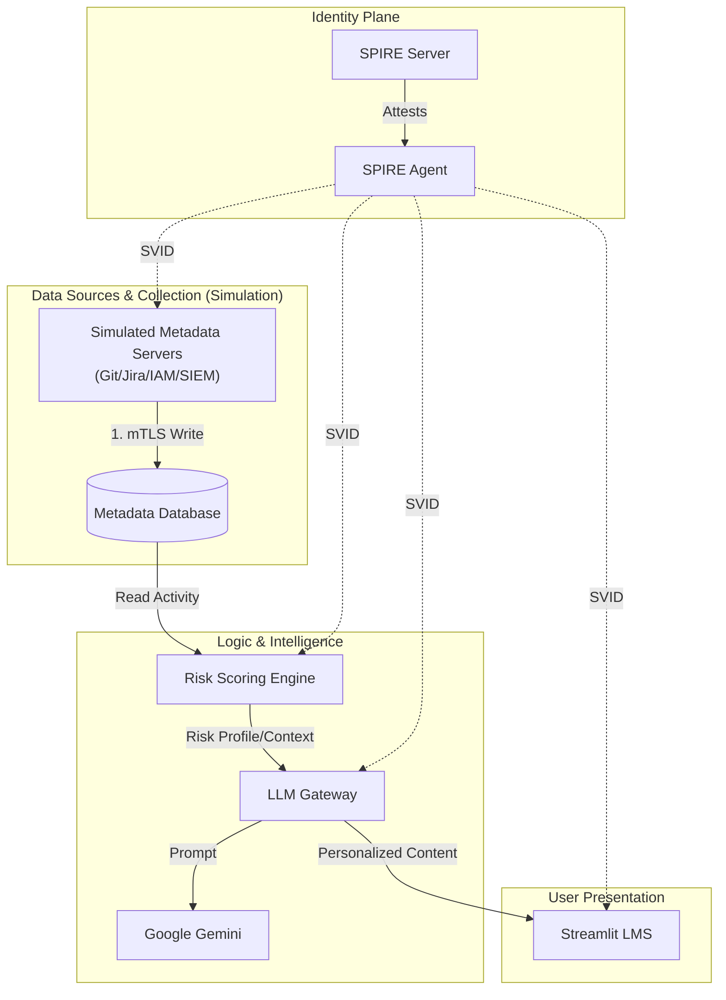

# Verification & Walkthrough

## 1. System Workflow
Based on the architecture defined in `LMS_PROJECT_CONTEXT.md`, here is the system data flow:



### The Architecture Chain
1.  **Employee Identity (Workday)**: The `workday_id` is the **Primary Key**. All data links to this ID, ensuring Joe's data feeds Joe's training.
2.  **Data Layer (Simulated Metadata Servers)**: Collectors generate deterministic "risky" metadata to demonstrate the Risk Engine.
3.  **Risk Engine**: Calculates a **0.0-1.0 Risk Score** which determines **Training Frequency** (Quarterly → Monthly → Sprint).
4.  **LLM Gateway**: Generates personalized training content via **Google Gemini** based on the specific risk context.
5.  **LMS**: Continuously updated. Schedules and delivers training at the correct frequency for each employee.

*(Note: In the current MVP implementation, the LMS acts as the orchestrator that retrieves Risk Data and passes it to the LLM Gateway to fulfill this logical chain.)*

## 2. Unit Tests
We implemented unit tests for the core `SPIFFEMTLSHandler` to ensure it operates correctly even when the SPIRE agent is not present (graceful fallback).

### Test Results
Run the tests with:
```bash
./scripts/setup-dev.sh
source .venv/bin/activate
pytest tests/
```

Expected output:
- `test_refresh_certificates_failure`: **PASSED** (Verifies graceful fallback)
- `test_refresh_certificates_success`: **PASSED** (Verifies correct parsing of SPIRE data)

## 2. Infrastructure Deployment

### Step 0: Build the Images (Local Dev)
Since you are running on Docker Desktop, we build the images locally so Kubernetes can see them.
```bash
./scripts/build.sh
```

### Step 1: Deploy with Helm
```bash
# Create namespace first
kubectl create namespace security-training

# Deploy (includes PostgreSQL, SPIRE, all services)
helm install security-system ./helm/security-training \
  --namespace security-training \
  --set secrets.geminiApiKey="YOUR_GEMINI_API_KEY"
```

Wait ~3 minutes for all pods to be ready:
```bash
kubectl get pods -n security-training -w
```

### Step 2: Run the IEEE Simulation
Once deployments are ready (wait ~2 mins), run the bulk simulation to generate data for 50 employees:

```bash
./scripts/run-simulation.sh
```
*This will seed 50 synthetic users (diverse job profiles) and generate risky events (Git, Jira, IAM) for them.*

### Step 3: Access the Dashboard
Port forward the LMS service:
```bash
kubectl port-forward svc/lms 8080:8080
```
Open [http://localhost:8080](http://localhost:8080) to view the personalized training plan.
For local testing without Kubernetes, you can run the services individually:

1. **Start Database:**
   ```bash
   docker-compose up -d
   ```

2. **Run Services:**
   ```bash
   # Terminal 1: Git Collector
   python -m src.collectors.git_collector
   
   # Terminal 2: Risk Scorer
   python -m src.engine.risk_scorer
   
   # Terminal 3: LMS Dashboard
   streamlit run src/lms/app.py
   ```

## 4. Architecture Verification
- **Code Duplication Removed**: All collectors inherit from `src.base.spiffe_agent.BaseSPIFFEAgent`.
- **SPIFFE Integration**: All services use `SPIFFEMTLSHandler` for authentication.
- **Database Schema**: Unified schema in `database/schema.sql` covers all metrics defined in the context.
